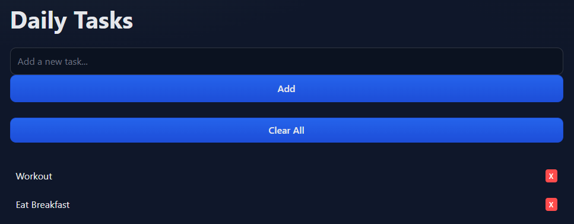

# D6 Implementation 2

## 1. Introduction

**Description:**
**Value Proposition:**
**Repistory: (link to github)**
**MVP:**
1. **Description:** Strive is a health-tracking system designed to help individuals improve their physical well-being through clear, science-backed guidance. Many people struggle with understanding diets, workout plans, and the overwhelming amount of nutrition information available. Strive addresses this by offering a streamlined platform where users can calculate macros, plan goals, and receive general recommendations. The system prioritizes clarity, simplicity, and actionable insights, especially for athletes such as wrestlers and fighters who must meet precise weight goals.
2. **Value Proposition:** Strive reduces confusion and decision-fatigue by consolidating essential health tools, such as BMI calculation, macro planning, and meal suggestions, into one intuitive interface. Instead of sifting through conflicting advice, users receive personalized, data-driven guidance to help them reach their goals more efficiently.
3. **Repistory:** (link to github)https://github.com/akg357/CS-386-HealthWebsite.git
4. **MVP:** The MVP focuses on delivering the core functionality users rely on most
BMI Calculator: Supports both metric and imperial systems through a clean interface
Macro Calculator: Provides protein and carbohydrate recommendations tailored to user-defined weight goals
Basic Meal Suggestions: Recommends options based on user's calorie and macro requirements.

## 2. Implemented Requirements 

### 2.1 Anna Cheatham

1. **Requirement:** As an honors student I want to have a daily task menu so I don't have to stress about making new schedules every day.
2. **Issue Link:** https://github.com/akg357/CS-386-HealthWebsite/issues/9
3. **Pull Request Link:** https://github.com/akg357/CS-386-HealthWebsite/pull/40
4. **Implemented By:** Anna Cheatham
5. **Approved By:** Aron Gebrezghr
6. **Automated Tests:** https://github.com/akg357/CS-386-HealthWebsite/blob/main/tests/tasklist_test.js
7. **Visual Evidence:** 

### 2.2 Josselin Retiguin

1. **Requirement:** As a user i want to be able to find the section I want within the main page easly so that I can find the sections faster.
2. **Issue Link:** https://github.com/akg357/CS-386-HealthWebsite/issues/41 
3. **Pull Request Link:** https://github.com/akg357/CS-386-HealthWebsite/pull/39
4. **Implemented By:** Josselin
5. **Approved By:** Aron
6. **Automated Tests:** 
7. **Visual Evidence:**  

### 2.3 Aron Gebrezghr

1. **Requirement:** As a user who visits the site, I want a navigation bar and a Resources page so that I can easily move between pages and quickly find approved health information.
2. **Issue Link:** https://github.com/akg357/CS-386-HealthWebsite/issues
3. **Pull Request Link:** No pull request – this requirement was implemented through direct commits to the main branch by the repository owner.  
Commit history:
https://github.com/akg357/CS-386-HealthWebsite/commits/main?author=akg357
Commit history of Owner sub account made to push files into main - https://github.com/akg357/CS-386-HealthWebsite/commits?author=akg357nau
4. **Implemented By:** Aron Gebrezghr was the author
5. **Approved By:** Abel Gebrezghr reviewed the implementation. I approved the changes  since I am the owner of the repository.
6. **Automated Tests:**
 - Clicking each item in the navigation bar to make sure it opened the correct page.  
 - Opening the Resources page and verifying that all links appeared and navigated to the correct external resources.
7. **Visual Evidence:** 

### 2.4 Abel Gebrezghr

1. **Requirement:** As a user , I want to write down my contact information so that medical experts can reach out to me for guidance .
2. **Issue Link:** https://github.com/akg357/CS-386-HealthWebsite/issues/30 
3. **Pull Request Link:** https://github.com/akg357/CS-386-HealthWebsite/pull/31
4. **Implemented By:** Abel Gebrezghr
5. **Approved By:**  Aron Gebrezghr
6. **Automated Tests:** https://github.com/akg357/CS-386-HealthWebsite/blob/contact-form-feature/tests/contactForm.test.js 
7. **Visual Evidence:** https://drive.google.com/file/d/1OzDDvqh-n7Q1LqS6QOmMJMUkGLcAQWQj/view?usp=sharing 

### 2.5 Emory WIlliams

1. **Requirement:** As a user, I want to calculate my BMI so that I can quickly understand my current health status.
2. **Issue Link:** https://github.com/akg357/CS-386-HealthWebsite/issues/35
3. **Pull Request Link:** https://github.com/akg357/CS-386-HealthWebsite/pull/47
4. **Implemented By:** Emory Williams
5. **Approved By:** Ethan Senger
6. **Automated Tests:** checking various values in the BMI calculation to make sure the resulting BMI was correct
7. **Visual Evidence:** 

 ### 2.6 Ethan Senger

1. **Requirement:**  As someone who exercises regularly, I want to get exercise recommendations so that I can exercise based on my personal needs. #12
2. **Issue Link:**  https://github.com/akg357/CS-386-HealthWebsite/issues/12
3. **Pull Request Link:** 
4. **Implemented By:**  Ethan Senger
5. **Approved By:** 
6. **Automated Tests:** 
7. **Visual Evidence:** https://docs.google.com/document/d/1cpObD6Wz5aAuojys6iUfkJjiqrRQDonPdLDNJUbSj8o/edit?usp=sharing

## 3. Automated Testing 

### 3.1 Unit Tests

**Test Framework:**
We used Jest 

**GitHub Repository Link:**
https://github.com/akg357/CS-386-HealthWebsite/tree/main/tests

**Detailed Example of Unit Test:**
GitHub link to the class under test
https://github.com/akg357/CS-386-HealthWebsite/blob/main/HealthService.js

GitHub link to the test file
https://github.com/akg357/CS-386-HealthWebsite/blob/main/tests/HealthService.test.js

Brief explanation of what behavior is being tested and which dependencies are being mocked
This test checks the getDailyCalories(userId) function in HealthService. Instead of calling a real API, what i dis was instead  mock apiClient.fetchUserMeals to return some fake meals with known calories. Then I call getDailyCalories("user-123") and make sure it calls the mock with the right user id and returns the correct total calories. This way I’m only testing my service logic, not any real backend.

**Screenshot:**

### 3.2 Integration Tests

**Test Framework/Tools:Mocha + JSDOM**
**GitHub Repository Link:https://github.com/akg357/CS-386-HealthWebsite/blob/main/tests/test_integration.js**
**Description of Scenario:Tests how the bmi interacts with main.js file and how the macro calculations interact 
      with the macros.js file**
**Example of Complete integration Test Case: the https://github.com/akg357/CS-386-HealthWebsite/blob/main/tests/test_integration.js 
       it shows the calls of the js files and how it has to wait for the attachment**
**Screenshot:               
   **

### 3.3 Acceptance Tests

**Testing Tools** Cypress
**GitHub Repository Link:** https://github.com/akg357/CS-386-HealthWebsite/tree/contact-form-feature/cypress/e2e
**Detailed Example of Acceptance Test:**  
User story: As a user, I want to submit my contact information so that medical or fitness personnel can reach me.

Step-by-step test scenario: 
1. Open http://127.0.0.1:5500/index.html
3. Enter "Abel" into the Name area
4. Enter "Abel@gmail.com" into the Email area
5. wrote "I want guidance on healthy weight." into the text area
6. Submit form 
7. Got the  "Thank you for contacting us!" message

Expected outcomes: user fills out sheet and gets confirmation  message when completed
GitHub link = https://github.com/akg357/CS-386-HealthWebsite/blob/contact-form-feature/cypress/e2e/contactForm.cy.js 
Code snippet: 
('Contact Form Acceptance Test', () => {
  beforeEach(() => {
    cy.visit('http://127.0.0.1:5500/index.html'); // Use your Live Server URL
  });

  it('should allow a user to fill and submit the contact form', () => {
    cy.get('#contactForm').should('be.visible');
    cy.get('#name').type('John Doe');
    cy.get('#email').type('john@example.com');
    cy.get('#message').type('I want guidance on healthy weight.');
    cy.get('#btnSubmit').click();
    cy.get('.successMessage')
      .should('be.visible')
      .and('contain', 'Thank you for contacting us!');
  });
});

**Screenshot:**
https://docs.google.com/document/d/1Ta0Ohe0qjkDtLIgQHmcinaFMNDcYUybAS4olP-44lMA/edit?usp=sharing
## 4. System Demonstration

**Video Link:** [Watch the video](https://www.youtube.com/watch?v=U0GLUINxUKA)

## 5. AI-Assisted Code Quality Review
Abels ai feedback
1.Test that the form shows an error when required fields are left blank.
2.Verify that an invalid email address triggers a validation error.
3.Check that very long messages can be submitted without breaking the form.
4.Ensure the form can be submitted multiple times in a row without issues.
Citation: AI-generated suggestions by ChatGPT, OpenAI, 2025.

AI feedback: seperatre UI updates from logic in exercise.js
Assigned Reviewer: Ethan Senger
Severity Assesment: [Medium]
DEcision: [Accepted]
Explanation: This is a good idea as ot seperatesx the logic from the UI manipulation, should make it easier for a unit test as well. Will also allow it to be easier to add onto in the future

Aron Gebrezghr AI Sugestions - 

 AI System ChatGPT
Model Version GPT-5.1 

Prompt Engineering

Prompt 1
  *Analyze the provided source code and  tell me a report focused on maintainability. Your analysis should cover design, and code quality. For each issue, give specific examples using file names and or snippets. Do not recommend external tools or libraries. Base your answer only on the code I provide.*

 Prompt 2
  *Based on the same code, list at least 8–10 specific, suggestions to improve maintainability. For each suggestion, state the file  describe the problem, propose a change, and assign a severity level (Critical/High/Medium/Low). 

Which worked better and why (1–2 sentences):
  Prompt 2 worked better because it forced the AI to give a numbered list of concrete, file-specific suggestions with severity levels, which made it easier to select four items and respond to them.

 Conversation Link
Not possible chatgpt linked to personal account 

Suggestion 1

AI Feedback 

   “Move the repeated navbar styles from the page-specific CSS file into the main stylesheet so that all pages use a single, shared definition of the navigation bar. This will avoid duplication and keep the header consistent across the site.”

 Assigned Reviewer
   Aron Gebrezghr

 Severity Assessment
   Medium

Decision
   Approved

 Explanation
I moved the `.navbar`, logo, and nav-link rules into the main stylesheet and updated the HTML to use those shared classes. This reduces duplicated CSS and ensures that any future change to the navbar only needs to be made in one place.

Suggestion 2

1. AI Feedback

    Several external links use `target="_blank"` but do not include `rel="noopener noreferrer"`. Add this attribute to improve security and prevent the new tab from accessing `window.opener`.

2. Assigned Reviewer
   Aron Gebrezghr
3. Severity Assessment
   High
4. Decision:
   Denied
5. Explanation:
   I dint  added `rel="noopener noreferrer"` to all external links that open in a new tab. It has no negative impact on user experience. 

Suggestion 3

1. AI Feedback

    The custom button and link styles do not define explicit focus styles, which can make keyboard navigation hard to see. Add clear `:focus` or `:focus-visible` outlines for links and buttons to improve accessibility.

2. Assigned Reviewer
   Aron Gebrezghr

3. Severity Assessment
   Medium

4. Decision
   Approved

5. Explanation
   I added focus styles that show a visible outline for links and buttons when they are focused via keyboard. This makes it much easier to see which element is active while tabbing through the page.

Suggestion 4

1. AI Feedback

    You define a color palette using CSS variables in one stylesheet, but other files still use hard-coded hex colors. Move those colors into variables and reference the variables instead, so the theme can be changed consistently in one place.

2. Assigned Reviewer
   Aron Gebrezghr

3. Severity Assessment
   Low–Medium

4. Decision
   Denied (partially)

5. Explanation
  This wasnt solving any existing problem 

Emory Williams AI Sugestions - 

 AI System ChatGPT
Model Version GPT-5.1 

Prompt Engineering

Prompt 1
  *Analyze the provided code and  tell me a report if anything should change to make sure the BMI calulation runs smoothly doesn't have any defects*

 Prompt 2
  *Based on the same code, give me a list of 5 different things that could be improved or deleted to make the code more readable and useful. 

Suggestion 1
**AI Feedback: "You have two DOMContentLoaded scripts in the HTML"
**Assigned Reviewer** Emory Williams
**Severity Assesment:** Low
**Decision:** Ignore for now maybe come back to later.
**Explanation: Not an issue immediately affecting the code, the risk of leading to race conditions can be addressed in a different week.

Suggestion 2
**AI Feedback: "Remove duplicate navigation bar block"
**Assigned Reviewer: Emory Williams
**Severity Assesment: Medium
**Decision: Do next week
**Explanation: Makes the site easier to navigate with less scrolling, cleaner file, and fewer future bugs. So will do this change soon to keep the code clean.

### Anna Cheatham AI Feedback
#### Suggestion 1

**AI Feedback:** Inconsistent naming and ambiguity:
- resetIfNewDay() vs scheduleMidnightReset() — names are okay but ambiguous about side effects. clearTasks() manipulates -storage but name doesn't indicate UI update.
- getTasks() and saveTasks() are fine, but there is no loadFromStorage vs loadIntoUI clarity.
- Why it hurts: Future maintainers unsure where to add features (e.g., marking persistent vs transient state).
  **Assigned Reviewer** Anna Cheatham
  **Severity Assesment:** [Low]
  **Decision:** [Denied]
  **Explanation:** I feel as if the names really do speak for themselves and aren’t that ambiguous. Like resetIfNewDay() does exactly as it says. It resets the tasks if a new day.

#### Suggestion 2

**AI Feedback:** No unique IDs for tasks:
- Tasks are stored as { text, completed } only. When two tasks have identical text, operations like deleteTask(index) are index-based, not id-based. This prevents stable task identity across operations and complicates reordering or syncing.
- Why it hurts: Difficult to add features (reorder, edit) without introducing unique identifiers.
  **Assigned Reviewer** Anna Cheatham
  **Severity Assesment:** [Low]
  **Decision:** [Denied]
  **Explanation:** As of right now, there are no plans to add those features to the task list so it wouldn’t really make a difference.

### 5.3 Individual Reflection

**Anna Cheatham: (Completed)**
**Josselin Retiguin: (Completed)**
**Aron Gebrezghr: (Completed)**
**Abel Gebrezghr: (Completed)**
**Emory WIlliams: (Completed)**
**Ethan Senger: (Completed)**

## 6. Retrosepctive Analysis

**Key Learnings:** As a group we definitely learned how important communication is. There was a lot of talking that had to be done in order to ensure that everything is organized and well done. Also, to ensure that no one was working on the same things at the same time. We also learned the importance of time management as our first implementation deliverable did not go as smoothly as this one. Overall, we learned how best to work together and make sure we actually have time to get things done to the level they need to be.
**Challenges Overcome:** We collectively all seemed to struggle with procrastination. There were many times we all waited until the last minute to do things and things just didn't go well for us. Eventually, we did learn to start working on things much earlier which ensured that our work went a lot more smoothly and stress free. There were some struggles with understanding github as well and just opting not to use it, but eventually we figured it out and was able to work well on it.
**Future Improvements:** If we were to continue working on this project, we would definitely be able to use what we learned and expand on it. We didn't flush out the website as much as we hoped, so we would work towards adding some other requirements that we missed due to time.
